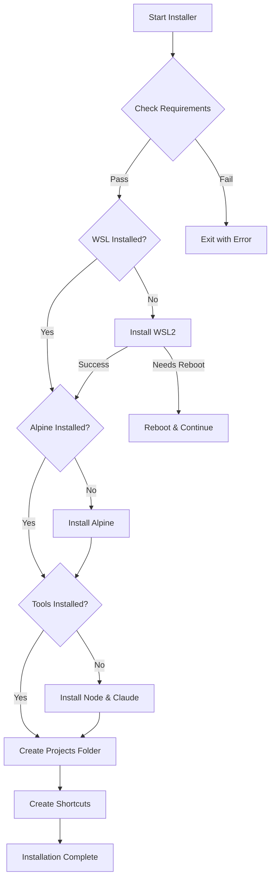

# Claude Code Windows Installer - Technical Specification & Implementation Plan
### Purpose
Create a user-friendly Windows installer (.exe) that enables non-technical users (specifically lawyers) to install and run Claude Code without any terminal or command-line interaction. The installer will automatically set up WSL2, node, curl, git, and Claude Code in a seamless, one-click (ideally, but not required) experience.
### Target Audience
- Legal professionals with minimal technical expertise
- Windows users who cannot or will not switch operating systems
- Users without Node.js, npm, or development tools installed
### Success Criteria
- ✅ Installation completes without user needing to open a terminal
- ✅ Claude Code launches successfully post-installation
- ✅ Works on standard Windows 10/11 business environments
- ✅ Uninstall removes all components cleanly
- ✅ 95%+ success rate across target Windows configurations

Here are the Main goals and Deliverables for this program! 

DELIVERABLES
By the end, the user needs to have installed:
    - Windows Subsystem for Linux (WSL2) (if they don't already have WSL installed, I think installing the Alpine WSL is the smallest and least obtrusive version.
    - Node.js LTS (to be installed in WSL)
    - npm package manager
    - Claude Code CLI package

Remember: These being installed is the goal!  Obviously, if people already have any one or all of these installed, it should say that that item is installed successfully and not try to re/overinstall things.

Also, during installation a folder "Claude Code Projects" (or a name the user specifies) should be created that should either be in the Documents folder or in a place that the user specifies.  In that folder, I want to insert a pre-filled claude.md file for the user that I will give you after you've made the plan. 

Lastly, upon installation, a shortcut should be created on the desktop that when the user clicks, will automatically launch wsl set to the Claude Code Projects folder and the run the claude command in that directory.

## Architecture Overview

### Core Design Principles
1. **Simplicity First**: Direct commands over complex module systems
2. **Fail-Safe**: Detect existing installations and skip appropriately
3. **User-Friendly**: Clear progress indicators and error messages
4. **Minimal Footprint**: Use Alpine Linux for WSL, clean uninstall

### Technology Stack
- **Installer Framework**: NSIS 3.x (with Modern UI 2)
- **Scripting**: PowerShell 5.1+ (Windows built-in)
- **WSL Distribution**: Alpine Linux (minimal ~50MB)
- **Target Platform**: Windows 10 version 2004+ (Build 19041+)

## File Structure

```
claude-code-installer/
├── build.nsi                    # Main NSIS script
├── assets/
│   ├── claude-icon.ico         # Application icon
│   ├── banner.bmp              # Installer banner (493x58)
│   └── wizard.bmp              # Installer wizard image (164x314)
├── scripts/
│   ├── check-requirements.ps1  # System validation script
│   ├── install-wsl2.ps1       # WSL2 installation script
│   ├── setup-alpine.ps1       # Alpine Linux setup script
│   ├── install-tools.ps1      # Node.js & Claude Code installer
│   └── create-shortcuts.ps1   # Shortcut creation script
├── templates/
│   └── CLAUDE.md              # Template file for projects folder
└── output/
    └── ClaudeCodeInstaller.exe # Generated installer
```

## Detailed Implementation Plan

### 1. Main NSIS Script (`build.nsi`)

```nsis
; Claude Code Installer
; Simple, robust installer using temporary PowerShell scripts

!include "MUI2.nsh"
!include "LogicLib.nsh"
!include "x64.nsh"

Name "Claude Code for Windows"
OutFile "output\ClaudeCodeInstaller.exe"
InstallDir "$LOCALAPPDATA\ClaudeCode"
RequestExecutionLevel admin

; Variables
Var ProjectsFolder
Var WSLDistro
Var RebootRequired

; Pages
!insertmacro MUI_PAGE_WELCOME
Page custom CheckSystemPage
Page custom SelectProjectsFolderPage
!insertmacro MUI_PAGE_INSTFILES
!insertmacro MUI_PAGE_FINISH

Section "Main"
    SetOutPath "$INSTDIR"
    
    ; Extract scripts
    File "scripts\*.ps1"
    File "templates\CLAUDE.md"
    
    ; Run installation steps
    Call CheckRequirements
    Call InstallWSL2
    Call SetupAlpine
    Call InstallTools
    Call CreateProjectsFolder
    Call CreateShortcuts
    
    ; Cleanup
    Delete "$INSTDIR\*.ps1"
SectionEnd
```

### 2. PowerShell Scripts

#### `check-requirements.ps1`
```powershell
# Simple requirements check - returns JSON for NSIS to parse
param()

$result = @{
    Success = $true
    WindowsValid = $false
    IsAdmin = $false
    WSLInstalled = $false
    Messages = @()
}

# Check Windows version
$build = [System.Environment]::OSVersion.Version.Build
if ($build -ge 19041) {
    $result.WindowsValid = $true
} else {
    $result.Success = $false
    $result.Messages += "Windows 10 version 2004 or later required"
}

# Check admin rights
$isAdmin = ([Security.Principal.WindowsPrincipal][Security.Principal.WindowsIdentity]::GetCurrent()).IsInRole([Security.Principal.WindowsBuiltInRole]::Administrator)
$result.IsAdmin = $isAdmin
if (-not $isAdmin) {
    $result.Success = $false
    $result.Messages += "Administrator rights required"
}

# Check WSL
try {
    $wslStatus = & wsl --status 2>$null
    if ($LASTEXITCODE -eq 0) {
        $result.WSLInstalled = $true
    }
} catch {}

# Output JSON
$result | ConvertTo-Json -Compress
```

#### `install-wsl2.ps1`
```powershell
# Install WSL2 - simple and direct
param()

try {
    # Check if already installed
    $wslCheck = & wsl --status 2>$null
    if ($LASTEXITCODE -eq 0) {
        Write-Output "WSL_ALREADY_INSTALLED"
        exit 0
    }
    
    # Install WSL with no distribution
    Write-Output "Installing WSL2..."
    & wsl --install --no-distribution
    
    if ($LASTEXITCODE -eq 3010) {
        Write-Output "REBOOT_REQUIRED"
        exit 3010
    } elseif ($LASTEXITCODE -eq 0) {
        Write-Output "WSL_INSTALLED"
        exit 0
    } else {
        Write-Output "WSL_INSTALL_FAILED"
        exit 1
    }
} catch {
    Write-Output "ERROR: $_"
    exit 1
}
```

#### `setup-alpine.ps1`
```powershell
# Setup Alpine Linux
param()

try {
    # Check if Alpine already exists
    $distros = & wsl --list --quiet 2>$null
    if ($distros -match "Alpine") {
        Write-Output "ALPINE_EXISTS"
        exit 0
    }
    
    # Install Alpine
    Write-Output "Installing Alpine Linux..."
    & wsl --install -d Alpine
    
    # Wait for installation
    Start-Sleep -Seconds 5
    
    # Set as default
    & wsl --set-default Alpine
    
    Write-Output "ALPINE_INSTALLED"
    exit 0
} catch {
    Write-Output "ERROR: $_"
    exit 1
}
```

#### `install-tools.ps1`
```powershell
# Install Node.js and Claude Code in Alpine
param()

$commands = @'
#!/bin/sh
# Update packages
apk update
apk add nodejs npm curl git

# Install Claude Code globally
npm install -g @anthropic-ai/claude-code

# Verify installation
claude --version
'@

try {
    # Save script to temp file
    $tempScript = "$env:TEMP\alpine-setup.sh"
    $commands | Out-File -FilePath $tempScript -Encoding ASCII -NoNewline
    
    # Execute in Alpine
    & wsl -d Alpine --exec sh < $tempScript
    
    if ($LASTEXITCODE -eq 0) {
        Write-Output "TOOLS_INSTALLED"
        exit 0
    } else {
        Write-Output "TOOLS_INSTALL_FAILED"
        exit 1
    }
} catch {
    Write-Output "ERROR: $_"
    exit 1
} finally {
    Remove-Item $tempScript -ErrorAction SilentlyContinue
}
```

#### `create-shortcuts.ps1`
```powershell
# Create desktop shortcut
param(
    [string]$ProjectsFolder
)

$WshShell = New-Object -ComObject WScript.Shell
$Shortcut = $WshShell.CreateShortcut("$env:USERPROFILE\Desktop\Claude Code.lnk")
$Shortcut.TargetPath = "wsl.exe"
$Shortcut.Arguments = "-d Alpine --cd `"$ProjectsFolder`" claude"
$Shortcut.WorkingDirectory = $ProjectsFolder
$Shortcut.IconLocation = "$env:LOCALAPPDATA\ClaudeCode\claude-icon.ico"
$Shortcut.Description = "Launch Claude Code in WSL"
$Shortcut.Save()

Write-Output "SHORTCUT_CREATED"
```

### 3. NSIS Function Implementations

```nsis
Function CheckRequirements
    DetailPrint "Checking system requirements..."
    
    ; Run check script
    nsExec::ExecToStack 'powershell.exe -ExecutionPolicy Bypass -File "$INSTDIR\check-requirements.ps1"'
    Pop $0 ; Exit code
    Pop $1 ; JSON output
    
    ; Parse results (simplified - you'd parse JSON properly)
    ${If} $0 != 0
        MessageBox MB_OK|MB_ICONSTOP "System requirements not met:$\n$1"
        Abort
    ${EndIf}
FunctionEnd

Function InstallWSL2
    DetailPrint "Installing WSL2..."
    
    nsExec::ExecToStack 'powershell.exe -ExecutionPolicy Bypass -File "$INSTDIR\install-wsl2.ps1"'
    Pop $0
    Pop $1
    
    ${If} $0 == 3010
        StrCpy $RebootRequired "true"
        MessageBox MB_YESNO "WSL2 installation requires a reboot. Reboot now?" IDYES RebootNow
        Return
        
        RebootNow:
        ; Set run-once registry key to continue after reboot
        WriteRegStr HKCU "Software\Microsoft\Windows\CurrentVersion\RunOnce" \
                    "ClaudeCodeInstaller" "$EXEPATH"
        Reboot
    ${ElseIf} $0 != 0
        MessageBox MB_OK|MB_ICONSTOP "WSL2 installation failed: $1"
        Abort
    ${EndIf}
FunctionEnd

Function SelectProjectsFolderPage
    nsDialogs::Create 1018
    Pop $0
    
    ${NSD_CreateLabel} 0 0 100% 20u "Select location for Claude Code Projects folder:"
    ${NSD_CreateDirRequest} 0 25u 80% 14u "$DOCUMENTS\Claude Code Projects"
    Pop $ProjectsFolder
    ${NSD_CreateBrowseButton} 82% 25u 18% 14u "Browse..."
    
    nsDialogs::Show
FunctionEnd
```

### 4. Installation Flow



### 5. Key Implementation Details

#### Handling Reboots
```nsis
Function .onInit
    ; Check if we're continuing after reboot
    ReadRegStr $0 HKCU "Software\ClaudeCode" "InstallStage"
    ${If} $0 == "PostReboot"
        ; Skip to Alpine setup
        Goto ContinueInstall
    ${EndIf}
FunctionEnd
```

#### Progress Tracking
```nsis
!define MUI_INSTFILESPAGE_PROGRESSBAR "smooth"

Function UpdateProgress
    ; Simple progress updates
    DetailPrint "Installing component..."
    Sleep 100 ; Give user time to see progress
FunctionEnd
```

#### Error Handling
```nsis
Function HandleError
    Pop $0 ; Error message
    
    MessageBox MB_RETRYCANCEL|MB_ICONEXCLAMATION \
        "Installation error: $0$\n$\nWould you like to retry?" \
        IDRETRY Retry IDCANCEL Cancel
        
    Retry:
        Return
    Cancel:
        Abort
FunctionEnd
```

### 6. Testing Strategy

1. **Test Matrix**:
   - Windows 10 (2004, 20H2, 21H1, 21H2, 22H2)
   - Windows 11 (21H2, 22H2, 23H2)
   - With/without existing WSL
   - With/without admin rights

2. **Automated Tests**:
   ```powershell
   # Test script for CI/CD
   .\test-installer.ps1 -Scenario "FreshWindows10"
   .\test-installer.ps1 -Scenario "ExistingWSL"
   ```

### 7. Maintenance Considerations

1. **Updates**: Check Claude Code npm package version
2. **Logs**: Save installation logs to `%TEMP%\ClaudeCodeInstall.log`
3. **Uninstaller**: Clean removal of Alpine distro and shortcuts

This architecture provides:
- ✅ Simple, maintainable code
- ✅ Clear separation of concerns
- ✅ Robust error handling
- ✅ Easy debugging (each script can be tested independently)
- ✅ No PowerShell module import issues

The key insight is to use temporary PowerShell scripts that NSIS extracts and executes, rather than trying to maintain complex PowerShell modules. This approach is much more reliable and easier to debug.
